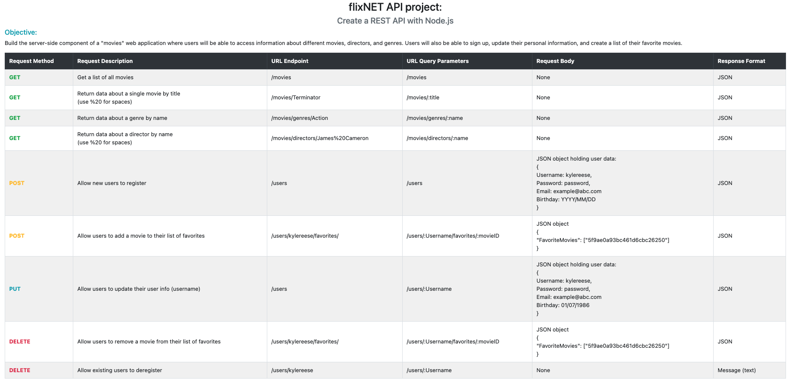

# Description
The server-side component of a "movies" web application that provides users with access to information about different movies, directors, and genres.  Users can sign up, update their personal information, and create a list of their favorite movies.

## API Details
* RESTful Architecture
* Built with Node.js and Express
* Uses middleware modules such as bodyParser and Morgan
* Database built using MongoDB
* Business logic modeled with Mongoose
* Information provided in JSON format
* Includes user authentication and authorization
* Includes data validation logic
* Deployed to Heroku

## Documentation

JSDoc documentation can be found in the "_out_" directory.  Additional details regarding API endpoints and request/response information can be found in the _documentation.html_ file in the "_public_" directory.  

See the _index.js_ file for the logic pertaining to each API endpoint.

## Base URL
https://flixnet-2020.herokuapp.com/